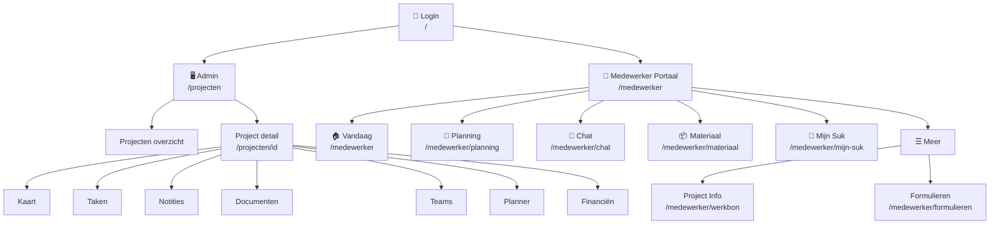
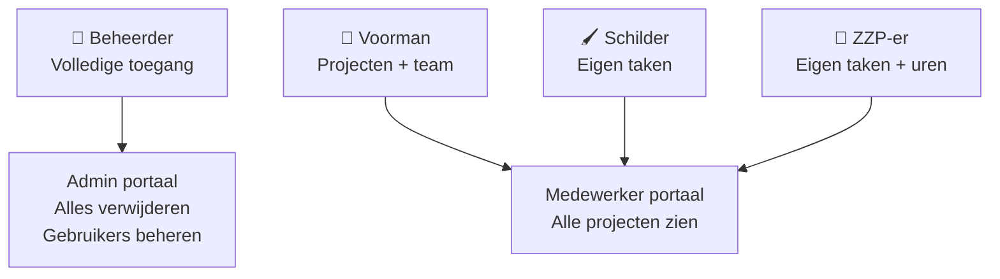
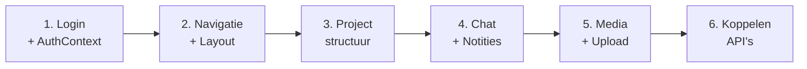

# SukApp — App Structuur

## Pagina's & Navigatie



## Data Flow

```mermaid
graph LR
    LS[(localStorage)] <--> MW_PAGES[Medewerker\nPagina's]
    DB[(MySQL\nDatabase)] <--> API[API Routes\n/api/*]
    API <--> MW_PAGES
    API <--> ADMIN_PAGES[Admin\nPagina's]
    NAS[(Synology NAS\nBestanden)] <--> UPLOAD[/api/upload]
    UPLOAD <--> MW_PAGES
    MS[(Microsoft\nGraph API)] <--> TEAMS_API[/api/teams/*]
    TEAMS_API <--> ADMIN_PAGES
```

## Herbruikbare Componenten

```mermaid
graph TD
    subgraph Componenten
        AUTH[AuthContext\nLogin + gebruiker]
        NAV[Bottom Nav\n6 tabs]
        HEADER[Header\nOranje gradient]
        CHAT_COMP[Chat Component\nNotities + Media + Replies]
        MEDIA_COMP[Media Grid\nFoto upload + viewer]
        NOTE_COMP[Notities\n5 types + bijlagen]
        PROJ_PICK[Project Picker\nDropdown switcher]
    end

    subgraph API
        NOTES[/api/notes\nCRUD notities]
        UPLOAD[/api/upload\nNAS bestanden]
        PROJECTEN[/api/projecten\nCRUD projecten]
        DOCS[/api/documenten\nPDF viewer]
    end

    CHAT_COMP --> NOTES
    CHAT_COMP --> UPLOAD
    MEDIA_COMP --> UPLOAD
    NOTE_COMP --> NOTES
    PROJ_PICK --> PROJECTEN
```

## Gebruikersrollen



## Nieuwe App Bouwen — Stappenplan



## Welke bestanden hergebruiken?

| Component | Bestand | Afhankelijkheden |
|-----------|---------|-----------------|
| Login + Auth | `src/components/AuthContext.jsx` | localStorage |
| Bottom nav | `src/app/medewerker/layout.js` | AuthContext |
| Chat pagina | `src/app/medewerker/chat/page.js` | /api/notes, /api/upload |
| Project info | `src/app/medewerker/werkbon/page.js` | /api/projecten |
| Planning | `src/app/medewerker/planning/page.js` | localStorage |
| Vandaag | `src/app/medewerker/page.js` | /api/projecten |
| Notes API | `src/app/api/notes/route.js` | MySQL |
| Upload API | `src/app/api/upload/route.js` | Synology NAS |
| Projecten API | `src/app/api/projecten/route.js` | JSON bestand |
